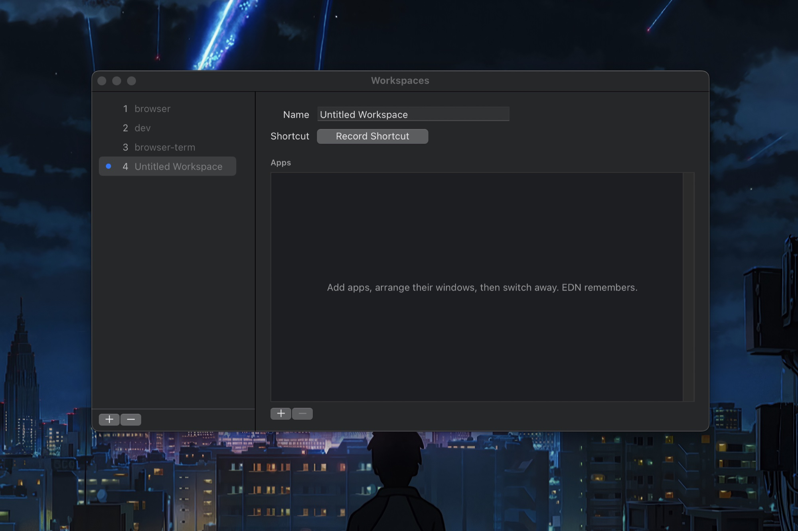
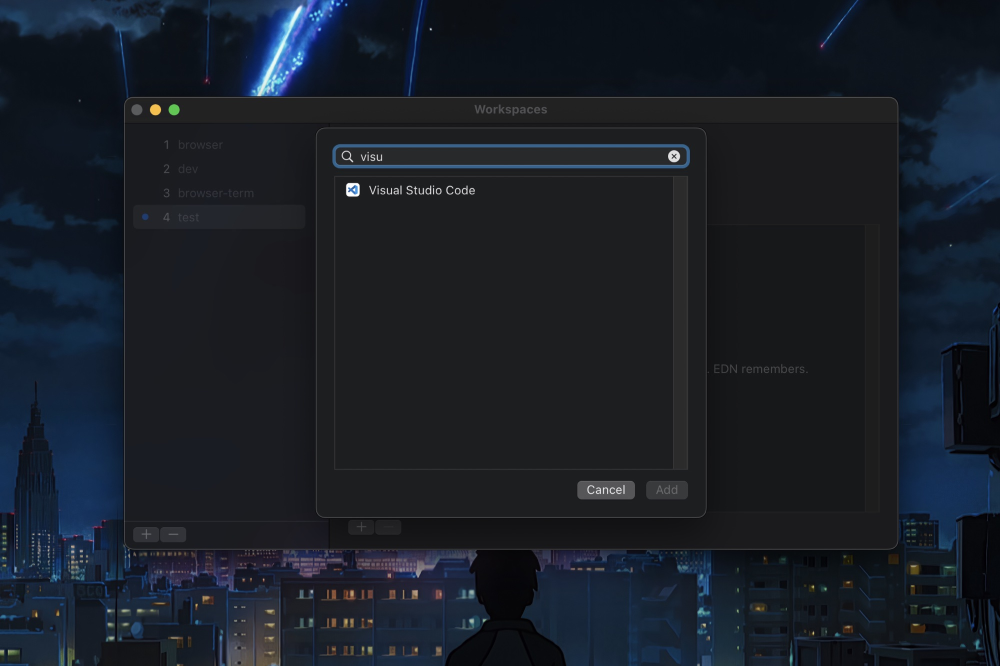
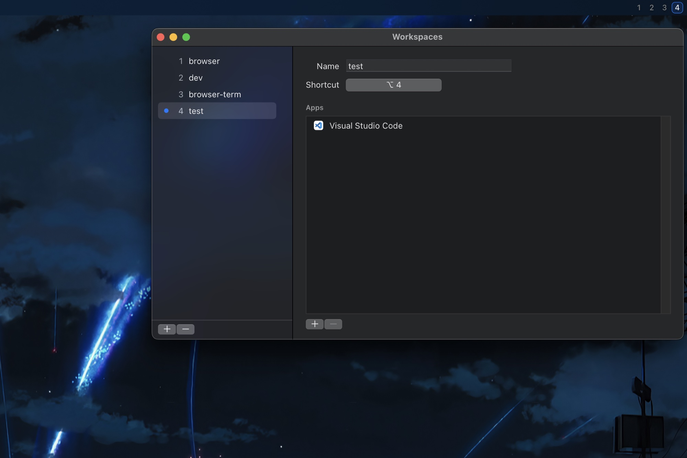

# EDN

EDN (pronounced “Eden”) is a fast, config-driven workspace manager for macOS. You choose which apps belong to a workspace, arrange their windows yourself, and EDN remembers and replays that layout when you return.

EDN uses app hiding and showing rather than Mission Control Spaces, so switching is immediate and animation-free. It does not calculate layouts, silently assign apps, or isolate individual windows of the same app.

**[Watch the 11-second demo →](docs/assets/demo.mp4)**

## The flow

**1. Start empty.** Create a workspace without inheriting whatever happens to be open.



**2. Choose the apps.** Membership is explicit and searchable.



**3. Give it a shortcut and arrange it.** The numbered menu-bar indicator shows where you are. Switch away and EDN remembers the layout exactly as you left it.



## Install

EDN is currently a technical preview. Beta builds are available from [GitHub Releases](https://github.com/jacobalarcon/edn/releases), but they are not yet notarized by Apple.

To try a beta:

1. Download and unzip EDN.
2. Move `EDN.app` to Applications and try to open it once.
3. When macOS blocks it, open **System Settings → Privacy & Security**, scroll to **Security**, click **Open Anyway**, then confirm **Open**. This is [Apple's supported override](https://support.apple.com/guide/mac-help/apple-cant-check-app-for-malicious-software-mchleab3a043/mac); never disable Gatekeeper globally.
4. EDN will then guide you through granting Accessibility access, which macOS requires to read and position windows.

Because beta builds use an ad-hoc signature, macOS may ask for Accessibility approval again after an update. A stable release requires Developer ID signing and notarization and will not carry this limitation.

For a local development build:

```sh
scripts/setup-local-signing.sh
scripts/build-app.sh
scripts/install-local.sh
```

The one-time local signing setup gives rebuilds a persistent macOS identity, so Accessibility approval survives development updates. It creates a self-signed certificate in your login keychain trusted only for code signing; it does not make the app suitable for public distribution.

The packaged CLI lives at `EDN.app/Contents/Helpers/edn`. A future Homebrew Cask will expose it automatically alongside the app.

## Command line and agents

Every finite command supports `--json`, so people, scripts, and agents use the same interface. Human-readable output remains the default.

```sh
edn list --json
edn windows --json
edn inspect coding --json
edn switch coding --json
```

`windows` reports the live desktop; `inspect` separates configured, remembered, and effective frames. Together they let an agent understand both what EDN was asked to do and what is actually on screen.

With `--json`, successful results go to standard output. Failures are emitted as a stable object on standard error and return a nonzero exit status:

```json
{"error":{"code":"workspace_not_found","message":"workspace not found: coding","command":"inspect"}}
```

`edn daemon --json` is the one long-running exception: it emits one compact JSON event per line as hotkeys are registered and switches occur.

## The model

- Workspace membership is explicit.
- Window positions are remembered automatically when you switch away.
- Config is plain JSON at `~/.config/edn/config.json`.
- Runtime layout state is kept separately at `~/.local/state/edn/state.json`.
- Workspaces are app-level. For complete isolation between two windows of the same app, use macOS Spaces.

## Build from source

EDN requires macOS 13 or newer and Swift 5.9 or newer. It has no third-party runtime dependencies.

```sh
swift test
scripts/build-app.sh
open dist/EDN.app
```

Set `EDN_UNIVERSAL=1` to build a universal Intel and Apple Silicon app. Set `EDN_CODE_SIGN_IDENTITY` to a Developer ID Application identity for distribution signing; local builds are ad-hoc signed.

## Release signing

GitHub’s release workflow expects these repository secrets:

- `APPLE_CERTIFICATE_P12_BASE64`
- `APPLE_CERTIFICATE_PASSWORD`
- `APPLE_SIGNING_IDENTITY`
- `APPLE_ID`
- `APPLE_APP_SPECIFIC_PASSWORD`
- `APPLE_TEAM_ID`
- `RELEASE_KEYCHAIN_PASSWORD`

Pushing a `v*` tag builds a universal app, signs it with Developer ID, notarizes it with Apple, staples the ticket, and publishes the ZIP and SHA-256 checksum.

## License

MIT
